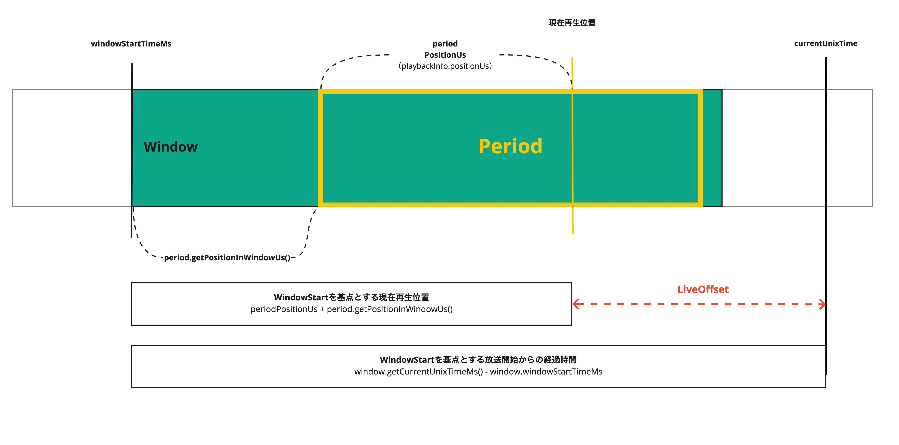

Title: ExoPlayerにおけるLiveOffset
Date: 2022-2-25
LastModified: 2022-5-16
Category: ExoPlayer
Authors: dev-platong

# Overview

ライブ再生に存在する概念であるライブオフセットについて扱います。  

- ライブオフセットとは何か
- ライブオフセットの決まり方

# LiveOffsetとは

LiveOffsetは、現在の時刻から再生位置が何秒遅れているかを示します。 FROM: [live-streaming.md#L11-L12](https://github.com/google/ExoPlayer/blame/r2.17.1/docs/live-streaming.md#L11-L12)



[ExoPlayerImplInternal.java#L1114-L1115](https://github.com/google/ExoPlayer/blob/r2.17.1/library/core/src/main/java/com/google/android/exoplayer2/ExoPlayerImplInternal.java#L1114-L1115)

`Player.getCurrentLiveOffset()` で取得できます。 SEE: [Player.html#getCurrentLiveOffset()](https://exoplayer.dev/doc/reference/com/google/android/exoplayer2/Player.html#getCurrentLiveOffset())

# LiveOffsetの決まり方

## HLSの場合

採択されるアルゴリズムにも優先順位がある。

1. `#EXT-X-START` がある場合

    マスタープレイリストまたはメディアプレイリストに記載される可能性があるタグです。  
    記載されたプレイリストからの相対位置または、絶対位置で定義できます（絶対位置はおそらくMasterPlaylistに記載する想定だと思われます）。  
    `#EXT-X-ENDLIST` タグがプレイリストに含まれていない場合（ライブ再生）ではTARGET DURATIONの3倍以下の値を設定すべきではないことが示されています。  
    
    [rfc8216#section-4.3.5.2](https://datatracker.ietf.org/doc/html/rfc8216#section-4.3.5.2)で規定されています。

2. `#EXT-X-SERVER-CONTROL` に `PART-HOLD-BACK` が設定されていて、part target durationがある場合

    Media Playlist限定のタグです。低遅延モードの時のプレイリストの終わりからの最小再生位置を示します。この値は最低でもPART TARGET DURATIONの2倍でなければいけません。また、PART TARGET DURATIONの3倍以上であるべきです。　　
    もし異なるレンディションが異なるPART TARGET DURATIONsを持っているならば、PART-HOLD-BACKは最低でもPART TARGET DURATIONの3倍であるべきです。

    [draft-pantos-hls-rfc8216bis#section-4.4.3.8](https://datatracker.ietf.org/doc/html/draft-pantos-hls-rfc8216bis#section-4.4.3.8)

    PART TARGET DURATIONについて

    [draft-pantos-hls-rfc8216bis#section-4.4.3.7](https://datatracker.ietf.org/doc/html/draft-pantos-hls-rfc8216bis#section-4.4.3.7)

3.  `#EXT-X-SERVER-CONTROL` に `HOLD-BACK` が設定されている場合

    Media Playlist限定のタグです。プレイリストの終わりからの最小再生位置を示します。

    [draft-pantos-hls-rfc8216bis#section-4.4.3.8](https://datatracker.ietf.org/doc/html/draft-pantos-hls-rfc8216bis#section-4.4.3.8)

4. 上記の項目が該当しない時

    TARGET DURATIONの3倍になります。

    [HLS spec 4.4.3.8](https://datatracker.ietf.org/doc/html/draft-pantos-hls-rfc8216bis-09#:~:text=Its%20absence%20implies%20a%20value%20of%20three%0A%20%20%20%20%20%20times%20the%20Target%20Duration.)


```java
  /**
   * Gets the target live offset, in microseconds, for a live playlist.
   *
   * <p>The target offset is derived by checking the following in this order:
   *
   * <ol>
   *   <li>The playlist defines a start offset.
   *   <li>The playlist defines a part hold back in server control and has part duration.
   *   <li>The playlist defines a hold back in server control.
   *   <li>Fallback to {@code 3 x target duration}.
   * </ol>
   *
   * @param playlist The playlist.
   * @param liveEdgeOffsetUs The current live edge offset.
   * @return The selected target live offset, in microseconds.
   */
  private static long getTargetLiveOffsetUs(HlsMediaPlaylist playlist, long liveEdgeOffsetUs) {
    HlsMediaPlaylist.ServerControl serverControl = playlist.serverControl;
    long targetOffsetUs;
    if (playlist.startOffsetUs != C.TIME_UNSET) {
      targetOffsetUs = playlist.durationUs - playlist.startOffsetUs;
    } else if (serverControl.partHoldBackUs != C.TIME_UNSET
        && playlist.partTargetDurationUs != C.TIME_UNSET) {
      // Select part hold back only if the playlist has a part target duration.
      targetOffsetUs = serverControl.partHoldBackUs;
    } else if (serverControl.holdBackUs != C.TIME_UNSET) {
      targetOffsetUs = serverControl.holdBackUs;
    } else {
      // Fallback, see RFC 8216, Section 4.4.3.8.
      targetOffsetUs = 3 * playlist.targetDurationUs;
    }
    return targetOffsetUs + liveEdgeOffsetUs;
  }
```

[HlsMediaSource.java#L582-L614](https://github.com/google/ExoPlayer/blob/r2.17.1/library/hls/src/main/java/com/google/android/exoplayer2/source/hls/HlsMediaSource.java#L582-L614)